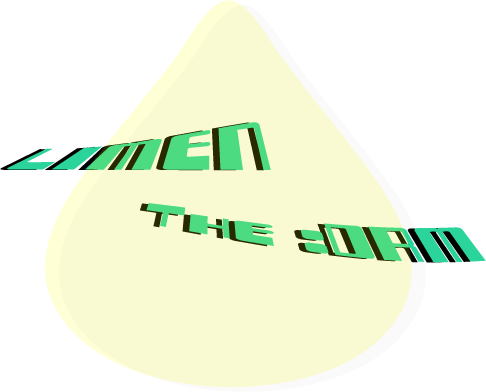

# Limen: The Offline DRM

## What is DRM?
Digital Rights Management (DRM) is a system designed to ensure that only the rightful owner of a file or software can use it and prevent unauthorized redistribution. While there have been many attempts to create foolproof DRM solutions in the past, they often come with caveats.

To learn more about these efforts, check out this video by [LGR](https://www.youtube.com/watch?v=HjEbpMgiL7U) (an awesome YouTuber, by the way).

---

## Why a New DRM?
Limen introduces a **new approach** to DRM that is **offline** and significantly more **user-friendly** compared to existing solutions in the market.

---

## Features
- Owners can create **offline copies**, including backups.
- Owners can use it on multiple devices (up to **64 devices**, tentatively).
- Requires **only one-time internet connection** for purchase.
- Optional: Prevent **screen recording** for video/audio content.

---

## How Does It Work?
Limen leverages **fingerprints** for authentication, offering:
- **Convenience:** Most smartphones today are equipped with fingerprint sensors, eliminating the need for additional hardware.
- **Security:** Fingerprints are faster and more secure than passwords or serial numbers.
- **Privacy:** Users are unlikely to share their fingerprint details, especially not online.

---

## Potential Challenges
### Collusion
- Multiple users working together to bypass DRM.

### Spoofing Fingerprints
- A malicious actor could generate fake fingerprints and emulate a fingerprint scanner for authentication. This would allow them to redistribute the DRM-protected content.

#### Solution:
To address spoofing:
1. Develop a **Machine Learning (ML) Model** to verify the validity of a fingerprint sequence.
2. Optionally link **Government IDs** during purchase for additional authenticity.

---

## Timeline
**Phase 1:** Encrypting and decrypting files using fingerprints.  
**Phase 2:** Fetching fingerprint data from phones in offline mode.  
**Phase 3 (Optional):** Screen recording prevention for video/audio content.  
**Phase 4:** Building a valid fingerprint verification ML model.

---

## Tech Stack
- **Python**
- **Kotlin**
- **JavaScript**
- **Rust**
- Additional tools and frameworks as needed.
## Phase wise Plan
# Phase 1
* Create Chunkify: A program which breaks a large file into small chunks and modifies them as per need of Limen *
---

